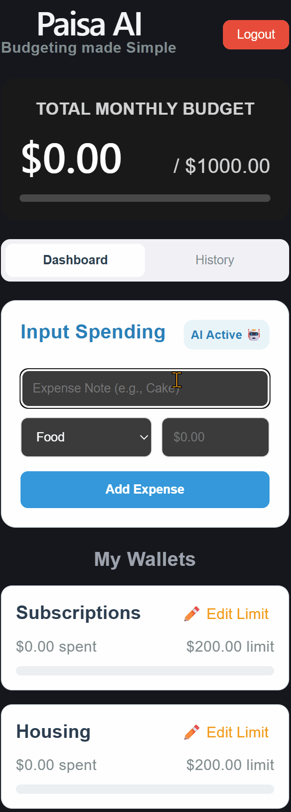

Adaptive Machine Learning Budgeting

This is a budget tracker that actually gets smarter the more you use it. It’s a full-stack app that uses a Python AI brain to guess where to categorise your spendings and learns from corrections in real-time.

